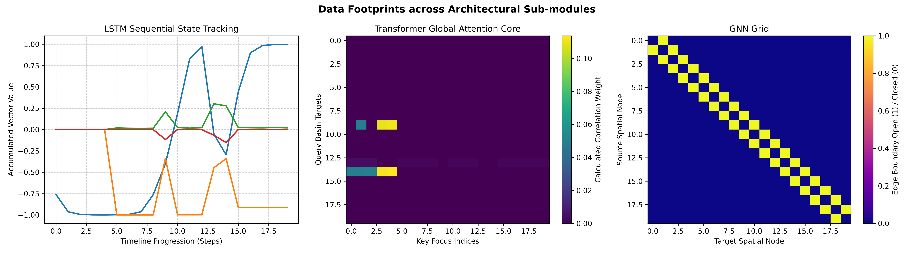

# deep-learning

The repository is intended for demonstrating the applications of the following three deep learning methods on complex, multi-variable climate dataset:

1- Long short-term memory (LSTM) 

Hochreiter, S., & Schmidhuber, J. (1997). Long Short-Term Memory. Neural Computation, 9(8), 1735-1780

2- Tranformer 

Vaswani, A., Shazeer, N., Parmar, N., Uszkoreit, J., Jones, L., Gomez, A. N., Kaiser, Ł., & Polosukhin, I. (2017). Attention Is All You Need. Advances in Neural Information Processing Systems, 30.

3- Graph neural networks (GNN)

Kipf, T. N., & Welling, M. (2017). Semi-Supervised Classification with Graph Convolutional Networks. International Conference on Learning Representations (ICLR).

# Data Source: 

For the purpose of highlighting the differences between the above mentioned methods, a dataset of 8,192 global watersheds across 13 distinct environmental risk indicators is imported from Aqueduct 4.0 (World Resources Institute). 

Kuzma et al. (2023), Aqueduct 4.0: Updated Decision-Relevant Global Water Risk Indicators World Resources Institute (WRI) Licensed under CC BY 4.0 https://www.wri.org/aqueduct. 

This dataset contains continuous physical values such as baseline water stress, groundwater table decline, drought risk, seasonal variability, and riverine flood risks.

By feeding the same dataset to each of the three methods, the underlying algorithmic design differences are then clearly revealed. 

# Code and libraries

The python script in included under src and employes the following packages: 

PyTorch, torch_geometric, pandas, geopandas, and matplotlib

# Workflow

1- Utilising CUDA for GPU computations

2- Reading the gdb data using pyogrio

3- Applications of each of LSTM, Transformer and GNN

4- Plotting and Visualisations

# Figure

# Findings 

* LSTM network treats the data as a chronological timeline with its internal mathematical gates accumulating local momentum step-by-step. The final output demonstrates sequential thresholding, where the model's memory layers remain stable until the incoming data features cross an environmental baseline, causing a sharp shift in the tracking states.
* the Transformer handles the data as a global context pool. It discards chronological order and evaluates all 8,192 records simultaneously using self-attention. The model automatically filters out background noise to place heavy mathematical focus on extreme climate anomalies, allowing it to map long-distance cause-and-effect relationships effectively.
* GNN examines the data as an interconnected geospatial map. By utilizing a fixed boundary blueprint, information is strictly confined to adjacent neighbors. The model visualizes how localized environmental stress scales and spills over directly across shared physical borders, mimicking the real-world terrain dynamics of watersheds.

# Furthre Steps

A reasonable next step would to include ground truth, which allows the methods to train on a supervised target. Nevertheless, the current representation has already reached the desired goal by revealing the architectural difference between the methods, rather than performing climate forecasting. 

Author 

Dr. Basel Ali
